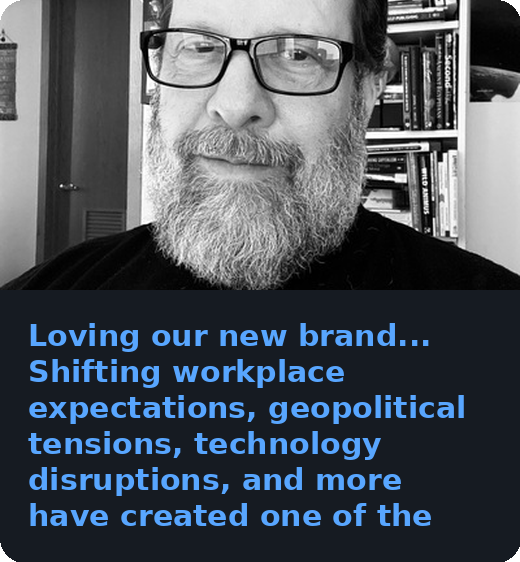
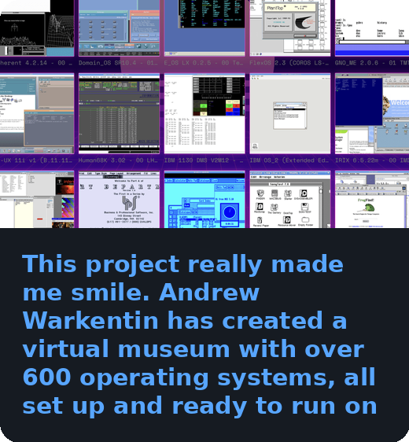

# 👋 Hi, I'm Brian Greenberg

- 🚀 Chief Information Officer @ RHR International
- 🎓 Cybersecurity Professor at DePaul University
- ✍️ Contributor on the Forbes Technology Council
- 🤖 Building AI-native workflows for the modern enterprise

I build AI-native systems for the modern enterprise, teach the next generation of cybersecurity professionals, and write about the intersection of technology, leadership, and ethics.

## 📊 GitHub Activity

  

##  Latest from the Blog

<!-- BLOG-POST-LIST:START -->

  
  
  

<!-- BLOG-POST-LIST:END -->

↑ Auto-updated daily from <a href="https://briangreenberg.net" target="_blank" rel="noopener noreferrer">briangreenberg.net</a> 

##  Latest from Mastodon

<!-- MASTODON-POST-LIST:START -->

  
  
  

<!-- MASTODON-POST-LIST:END -->

↑ Auto-updated daily from <a href="https://infosec.exchange/@brian_greenberg" target="_blank" rel="noopener noreferrer">infosec.exchange/@brian_greenberg</a> 

## 🌐 Connect with Me

  
  
  

## ✍️ Thought Leadership & Content

  
  
  
  
  

## 💼 Social & Professional Networks

  
  
  
  
  
  
  

## 📚 Academic & Teaching

  

## 🎧 Creative & Social

  
  
  

> "Technology is only as powerful as the intentions of the people behind it."
