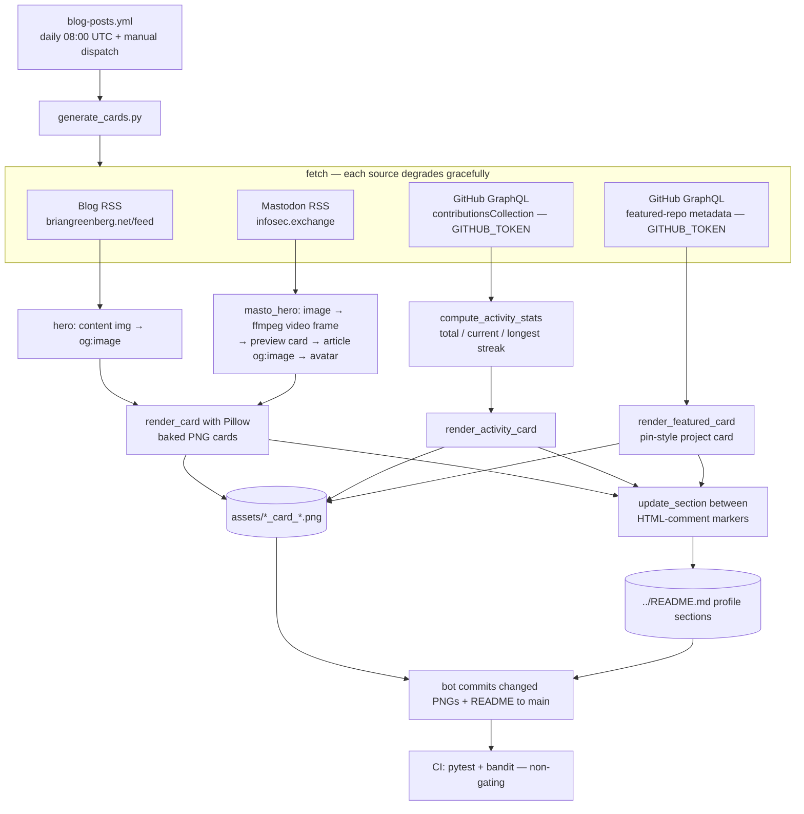

# Profile README automation

Last updated: 2026-07-07 06:19 PM CDT

[](https://github.com/bjgreenberg/bjgreenberg/actions/workflows/ci.yml)
[](../LICENSE)

Generates the **GitHub Activity**, **Featured Project**, **Latest from the
Blog**, and **Latest from Mastodon** sections of the GitHub profile README
(`../README.md`) as borderless, clickable image "cards", refreshed daily by
GitHub Actions.

---

## Pipeline at a glance

One daily run: the workflow invokes `generate_cards.py`, which pulls four
sources, picks a hero image per item (each step degrading gracefully), bakes the
PNG cards with Pillow, rewrites only the fenced README sections, and the bot
commits any changed assets + README back to `main`. Each piece is detailed in
the sections below.



---

## Why image cards instead of an HTML table

GitHub's markdown sanitizer **strips `border` and `style` attributes** from
`<table>` tags and applies its own cell borders, so a clean borderless card grid
is impossible with live HTML. It also strips `<map>`/`<area>`, ruling out image
maps.

The workaround: render each post to a **self-contained PNG** (featured image +
title/blurb baked in) and place three per row inside a `<p align="center">`. No
`<table>`, so **no borders**. Each card is wrapped in its own
`<a href="post-url">`, so every card is **independently clickable**.

> **New-tab note:** GitHub's sanitizer strips `target="_blank"` from anchors in
> README content, so links open in the **same tab** on github.com. The
> attributes are kept in our generated HTML (correct, and honored if the README
> is viewed elsewhere), but github.com ignores them. This is a platform
> limitation with no reliable workaround.

### Trade-off

The title/blurb text is rasterized into the image — it is **not selectable or
indexable** by search engines. The post title is carried in the ``
attribute for basic screen-reader accessibility.

---

## Prerequisites

- Python 3.12+
- Pillow (pinned in [`requirements.txt`](requirements.txt))
- A TrueType font:
  - **Ubuntu CI** — DejaVu (`fonts-dejavu-core`, preinstalled on `ubuntu-latest`)
  - **macOS (local)** — Arial (preinstalled)
  - Falls back to Pillow's bitmap font if neither is found (ugly but non-fatal)
- A GitHub token in `GH_TOKEN` (preferred) or `GITHUB_TOKEN`, used **only** for
  the GraphQL queries behind the GitHub cards (contribution calendar +
  featured-repo metadata). In CI the workflow passes the auto-injected
  `GITHUB_TOKEN`; locally, `GH_TOKEN=$(gh auth token)` works. With no token the
  GitHub cards are skipped (the rest still runs).
- **ffmpeg** on `PATH`, used **only** to extract a hero frame from Mastodon video
  attachments. Preinstalled on GitHub's `ubuntu-latest` runners; install locally
  with `brew install ffmpeg`. If absent, video posts fall back to the poster/avatar
  (the card still renders) — it is not required for blog/activity cards.

## Setup

```bash
pip3 install -r scripts/requirements.txt
```

## Usage

```bash
# Regenerate cards + rewrite the README sections in place
python3 scripts/generate_cards.py

# Render cards but leave README.md untouched (inspect assets/ output)
python3 scripts/generate_cards.py --dry-run

# Include the GitHub Activity card locally (needs a token):
GH_TOKEN="$(gh auth token)" python3 scripts/generate_cards.py
```

Cards are written to `../assets/blog_card_{1..3}.png`,
`../assets/masto_card_{1..3}.png`, `../assets/activity_card.png`, and
`../assets/featured_card.png`. The script overwrites the same filenames each
run, so the README references are stable.

## How it runs in production

[`.github/workflows/blog-posts.yml`](../.github/workflows/blog-posts.yml) runs
daily at **08:00 UTC** (and on manual dispatch from the Actions tab). It installs
Pillow, runs the script, and commits any changed PNGs + README. The only secret
used is the automatically-provided `GITHUB_TOKEN` (no configuration required).

No cost: the profile repo is public, and GitHub Actions is free for public repos.

---

## Data sources

| Section | Feed | Image source |
|---|---|---|
| GitHub Activity | GitHub GraphQL `contributionsCollection` | Computed metrics rendered to `activity_card.png` (no external image — total, current streak, longest streak). A baked trailing-year heatmap card was added and removed 2026-07-07 — redundant with the native contribution graph GitHub renders directly below the profile README; don't re-add |
| Featured Project | GitHub GraphQL repo metadata (description, stars, forks, license, latest release, language) | Rendered to `featured_card.png` — a self-hosted pin card, refreshed daily so the numbers stay honest |
| Blog | `https://briangreenberg.net/feed/` | First `` in `<content:encoded>`; falls back to the post page's `og:image` meta tag |
| Mastodon | `https://infosec.exchange/@brian_greenberg.rss` | First **image** `<media:content>` attachment → for a **video**, a frame extracted with **ffmpeg** (then the instance poster if it isn't blank) → for a **link** post, the instance's cached preview card (`/api/v1/statuses/{id}` → `card.image`), then the linked article's `og:image` → account avatar |

The Mastodon hero is chosen by priority (`masto_hero`, which returns either a
URL to fetch or pre-decoded image **bytes**): a `<media:content>` attachment is
used directly only when its `medium`/`type` is an **image**. For a **video**
attachment, `extract_video_frame` downloads the clip and pulls a real frame with
ffmpeg — Mastodon's own poster is frame 0, which is frequently a blank intro card
(observed: a solid `#f2f2f2` square). We skip frame 0 and try a few seconds in
(`VIDEO_FRAME_SECONDS`), returning the first frame with real content
(`_image_has_content`). If ffmpeg is unavailable or every frame is blank, we fall
back to the instance poster (when not blank). For a **link** post, the hero comes
from the instance's own cached preview card (`masto_card_image` reads `card.image`
from the status API) — rehosted on `media.infosec.exchange`, the same CDN the
avatar loads from, so reliably reachable from CI. Direct article `og:image`
scraping is only a fallback: news sites frequently block GitHub Actions' datacenter
IPs (a Gizmodo link resolved locally but fell back to the avatar on the runner).

Mastodon link-share posts (a bare URL with no caption) are skipped. Emoji are
stripped from the baked card text because the bundled fonts have no color-emoji
glyphs (the link still points at the full original post).

---

## Files and modules

### `generate_cards.py`

| Function | Purpose |
|---|---|
| `fetch_url` | HTTP GET with a UA header; optional byte cap for `<head>` scraping |
| `fetch_rss` | Fetch + parse an RSS feed to an XML root element |
| `strip_tags` / `collapse_ws` | Clean HTML and whitespace from feed text |
| `strip_emoji` | Drop glyphs the fonts can't render (emoji/symbols) |
| `make_excerpt` | Word-boundary truncate with an ellipsis |
| `is_bare_url` | Detect caption-less Mastodon link shares (skipped) |
| `strip_photon` | Rewrite Jetpack Photon CDN URLs (`iN.wp.com`) to their origin |
| `asset_version` | Content hash appended as `?v=` to card URLs (cache busting) |
| `og_image` | Scrape a page's `og:image` (post permalink or linked article); HTML-unescapes the result |
| `media_kind` | Classify a `<media:content>` as `image`/`video`/`audio` (by `medium`, then MIME `type`) |
| `first_article_link` | First outbound article URL in a toot body, skipping mention/hashtag anchors |
| `masto_card_image` | Instance-cached link-preview image via `/api/v1/statuses/{id}` (`card.image`) — CDN-hosted, CI-reliable |
| `extract_video_frame` | ffmpeg frame grab from a video attachment (skips blank frame 0); returns PNG bytes or None |
| `_image_has_content` | True if image bytes aren't a near-flat single color (shared blank-frame check) |
| `usable_image` | `_image_has_content` over a downloaded URL — rejects a blank poster so selection falls through |
| `masto_hero` | Priority hero for a Mastodon card → URL or frame bytes (image → ffmpeg frame/poster → preview/article → avatar) |
| `_find_font` / `_fonts` | Cross-platform (Ubuntu/macOS) TrueType font loading |
| `fetch_photo` | Crop-to-fill a hero from a URL **or** pre-decoded bytes; neutral placeholder on failure |
| `_wrap` | Greedy pixel-width word wrap |
| `render_card` | Render one RGBA card (rounded corners, photo + text) |
| `build_blog_cards` / `build_masto_cards` | Per-feed card builders → `list[Card]` |
| `github_token` | Read `GH_TOKEN`/`GITHUB_TOKEN` from env (None → skip all GitHub cards) |
| `_github_graphql` | POST one GitHub GraphQL query; raises on API errors |
| `fetch_contribution_days` | GraphQL contribution calendar, year-by-year, all-time |
| `compute_activity_stats` | Total + current + longest streak (pure logic, future days dropped) |
| `render_activity_card` | Render the 3-panel activity card (total / ring / longest) + "Updated …" footer |
| `_activity_stamp` | Format the footer timestamp in Chicago local time (CST/CDT), 12-hour |
| `build_activity_card` | Render the streak/stats card from pre-fetched days → `Card` |
| `fetch_repo_meta` | Featured repo's live metadata (stars/forks/license/release/language) via GraphQL |
| `featured_meta_line` | Compose the pin card's `·`-separated metadata row, skipping absent fields (pure logic) |
| `render_featured_card` / `build_featured_card` | Render the pin-style Featured Project card → `Card` |
| `cards_to_html` / `activity_to_html` | Centered `<p>` of `<a></a>` link(s) |
| `update_section` | Replace content between `<!-- TAG:START/END -->` markers |
| `main` | Orchestrate both feeds; `--dry-run` supported |

`Card` is a `TypedDict` describing a rendered card (asset path, README `src`,
post URL, alt text).

---

## Troubleshooting

| Symptom | Cause / fix |
|---|---|
| Card text renders as boxes (tofu) | Font not found on the runner. Confirm `fonts-dejavu-core` is present; `_find_font` logs a warning when it falls back to the bitmap default. |
| A card shows a gray placeholder | The chosen hero URL failed to download (`fetch_photo` fell back to `PLACEHOLDER_BG`). Check the post's `og:image` / `<media:content>` / article URL is reachable. |
| A Mastodon **video** post showed a blank/empty hero | Mastodon's poster is frame 0 (often a blank intro card). `extract_video_frame` now pulls a later frame with ffmpeg. If you still see blank: ffmpeg isn't on the runner's `PATH` (logs `ffmpeg not found`), the download failed, or every sampled frame was blank — it then falls back to the poster/avatar. |
| `ffmpeg not found` in logs | ffmpeg isn't installed. It's preinstalled on `ubuntu-latest`; locally run `brew install ffmpeg`. Video posts degrade to the poster/avatar without it — not fatal. |
| A Mastodon card showed the same avatar as another | Old behavior: posts with no media all fell back to the single account avatar. Fixed — link posts now use the instance's cached preview card (`card.image`). The avatar is only the last resort for a genuinely image-less, link-less post. |
| A Mastodon **link** post showed the avatar on CI but the article image locally | The news site blocked/rate-limited the GitHub Actions datacenter IP during the direct `og:image` scrape. `masto_card_image` now pulls the preview from the instance CDN (`media.infosec.exchange`) instead, which the runner reaches reliably; the direct scrape is only a fallback. |
| Blog card has no image | The post had no inline image **and** no `og:image`. Add a featured image to the post. |
| Cards in a row have uneven heights | Should not happen — height is fixed per section via the `*_LINES` constants. If you change those, both cards in a section must use the same values. |
| `pip install` fails on the runner | The pinned Pillow version may lack a wheel for the runner's Python. Bump `Pillow==` in `requirements.txt` to a version with a `cp312` wheel. |
| Emoji missing from card text | Expected — emoji are stripped (no color-glyph support). The full post still has them. |
| GitHub Activity card missing / not updating | No token available (`github_token()` logged a warning and the section was skipped), or the GraphQL call failed. Confirm the workflow passes `GITHUB_TOKEN`; locally run with `GH_TOKEN=$(gh auth token)`. |
| Current streak shows 0 despite recent activity | The contribution calendar includes future days (count 0 through Dec 31); `compute_activity_stats` drops days after today so they can't read as a broken streak. If you still see 0, the most recent contribution is older than yesterday. |
| Streak/total numbers look low | The streak metric favors daily public commits. These are computed from the real contribution calendar — they are accurate, not a bug. |

## Known limitations

- Baked text is not selectable/searchable (see trade-off above).
- Cards use a fixed GitHub-dark palette; they look identical on GitHub's light
  and dark themes (a deliberate dark card either way) thanks to transparent
  rounded corners.
- Three 260px cards (~810px total) fit GitHub's README content width. If a row
  wraps, reduce `DISPLAY_W` in `generate_cards.py`.
- Links open in the **same tab** on github.com — GitHub strips `target="_blank"`
  from README anchors (see the New-tab note above).
- Hero images are center-cropped to fill the card (`ImageOps.fit`); the edges of
  very wide or very tall source images are trimmed rather than letterboxed.
- Daily runs commit ~6 small PNGs; filenames are reused so the working tree
  stays flat, but git history does accrue blobs over time.

## CI

Every push to `main` (including the daily bot commit) runs the CI workflow
(`.github/workflows/ci.yml`): the `test` job (pytest + bandit on
`generate_cards.py`, Python 3.12 to match the bot's production runtime) and the
`docs-render` job (renders every Mermaid diagram in the repo's Markdown via the
digest-pinned `mermaid-cli` container — `scripts/render-diagrams.sh`).
Both are **non-gating by design** — `main` has no branch protection (the daily
bot commits directly; documented exemption) — so a red run is an email alarm,
not a merge gate.
